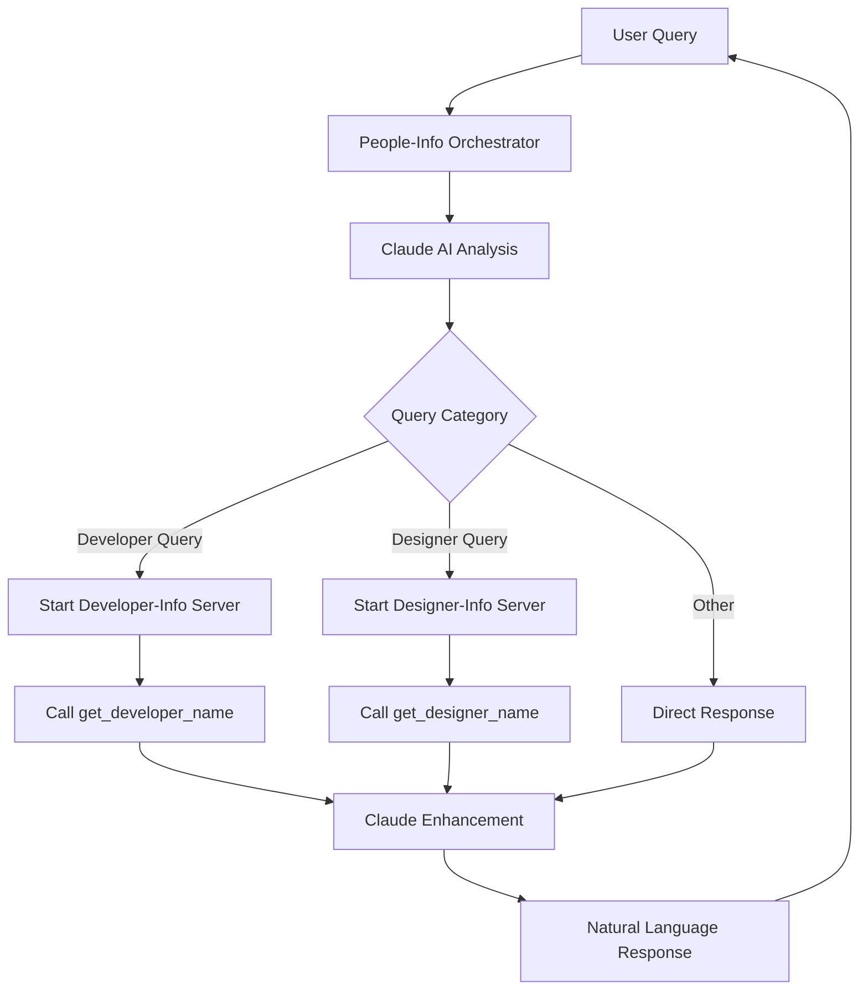

# MCP Server Orchestration Project

An intelligent Model Context Protocol (MCP) orchestration system that demonstrates dynamic server coordination and AI-powered query routing. This project showcases how a primary MCP server can intelligently analyze natural language queries and dynamically call specialized MCP servers to provide comprehensive responses.

## 🧠 Architecture Overview



## 🎯 How It Works

1. **User asks a natural language question** like *"What is the developer's name?"*
2. **People-info orchestrator** receives the query
3. **Claude AI analyzes** the query to determine intent and category
4. **Orchestrator dynamically starts** the appropriate specialized server
5. **MCP client calls** the right tool on the specialized server
6. **Raw data is enhanced** by Claude AI into a natural response
7. **User receives** a conversational, helpful answer

## 🏗️ Project Structure

```
MCP-Server/
├── people-info-server/          # 🧠 Main orchestrator (ADD THIS TO CLAUDE DESKTOP)
│   ├── index.js                 # Intelligent routing and MCP client logic
│   ├── package.json             # Dependencies including MCP client SDK
│   ├── .env.template            # Environment template
│   └── README.md                # Detailed orchestrator documentation
├── developer-info-server/       # 👨‍💻 Developer data server
│   ├── index.js                 # Returns developer information
│   └── package.json             # Simple MCP server
├── designer-info-server/        # 🎨 Designer data server
│   ├── index.js                 # Returns designer information
│   └── package.json             # Simple MCP server
├── setup.sh                     # One-command setup script
├── QUICK_START.md               # Super simple setup guide
└── README.md                    # This file
```

## 🚀 Quick Start

> **🚨 IMPORTANT FOR NEW USERS**: If you're setting up this project on a different machine, you need to update 2 critical paths. See the [Path Configuration Guide](#-path-configuration-for-sharing) below.

### Option 1: One-Command Setup
```bash
./setup.sh
```

### Option 2: Manual Setup
```bash
cd people-info-server
npm install
cp .env.template .env
# Edit .env and add your ANTHROPIC_API_KEY
```

### Add to Claude Desktop
Add **only the orchestrator** to your Claude Desktop MCP settings:

```json
{
  "mcpServers": {
    "people-info": {
      "command": "node",
      "args": ["/Users/banik/Desktop/Projects2025/MCP-Server/people-info-server/index.js"],
      "env": {
        "ANTHROPIC_API_KEY": "your_anthropic_api_key_here"
      }
    }
  }
}
```

## 🎮 Usage Examples

### Natural Language Queries

**Ask about developers:**
```xml
<use_mcp_tool>
<server_name>people-info</server_name>
<tool_name>get_people_info</tool_name>
<arguments>
{
  "query": "What is the developer's name?"
}
</arguments>
</use_mcp_tool>
```

**Ask about designers:**
```xml
<use_mcp_tool>
<server_name>people-info</server_name>
<tool_name>get_people_info</tool_name>
<arguments>
{
  "query": "Tell me about the designer on the team"
}
</arguments>
</use_mcp_tool>
```

**General questions:**
```xml
<use_mcp_tool>
<server_name>people-info</server_name>
<tool_name>get_people_info</tool_name>
<arguments>
{
  "query": "Who is the frontend developer?"
}
</arguments>
</use_mcp_tool>
```

## 🔧 Technical Features

### 🧠 AI-Powered Query Analysis
- Uses Claude 3.5 Sonnet to understand user intent
- Categorizes queries as developer, designer, or other
- Determines appropriate action (get name, get info, etc.)

### 🔄 Dynamic Server Orchestration
- Starts specialized MCP servers on-demand
- Maintains connections for efficiency
- Proper cleanup and resource management

### 🌐 Real MCP Protocol Communication
- Uses official MCP SDK for client-server communication
- Proper JSON-RPC protocol implementation
- Error handling and fallback mechanisms

### 💬 Natural Language Enhancement
- Raw server responses enhanced by Claude AI
- Conversational, context-aware answers
- Maintains query context throughout the flow

## 📊 Data Separation

### Developer-Info Server
- **Name**: "Neick"
- **Purpose**: Stores and provides developer information
- **Tool**: `get_developer_name`

### Designer-Info Server  
- **Name**: "Jesse"
- **Purpose**: Stores and provides designer information
- **Tool**: `get_designer_name`

### People-Info Orchestrator
- **No data storage** - pure orchestration logic
- **AI analysis** and **MCP client** functionality
- **Response enhancement** and **natural language processing**

## 🎯 Benefits of This Architecture

1. **Separation of Concerns**: Each server has a single responsibility
2. **Scalability**: Easy to add new specialized servers
3. **Natural Interface**: Users can ask questions in plain English
4. **Dynamic Resource Usage**: Servers only run when needed
5. **AI Enhancement**: Raw data becomes conversational responses
6. **Real MCP Protocol**: Demonstrates proper MCP client-server communication

## 🔍 Example Interaction Flow

**User Query**: *"What is the developer's name?"*

1. **Orchestrator receives** query
2. **Claude analyzes**: `{"category": "DEVELOPER", "action": "GET_NAME"}`
3. **Orchestrator starts** developer-info server
4. **MCP client calls** `get_developer_name` tool
5. **Server responds**: `{"content": [{"type": "text", "text": "Neick"}]}`
6. **Claude enhances**: *"The developer's name is Neick."*
7. **User receives** natural response

## 🛠️ Development & Testing

### Test Individual Servers
```bash
# Test developer server
cd developer-info-server && npm start

# Test designer server  
cd designer-info-server && npm start

# Test orchestrator
cd people-info-server && npm start
```

### Add New Specialized Servers
1. Create new server directory (e.g., `manager-info-server`)
2. Implement MCP server with appropriate tools
3. Update orchestrator's analysis logic to recognize new categories
4. Add MCP client calls for the new server

## 🏆 Advanced MCP Concepts Demonstrated

- **Multi-server orchestration**
- **Dynamic server lifecycle management**
- **MCP client-server communication**
- **AI-powered request routing**
- **Natural language query processing**
- **Response enhancement and formatting**

## 🔧 Path Configuration for Sharing

If you're setting up this project on a **different machine** than the original developer, you need to update these paths:

### **1. Update Node.js Path in Code**
Edit [`people-info-server/index.js`](people-info-server/index.js) line 84:
```javascript
// Change this hardcoded path:
command: '/Users/banik/.nvm/versions/node/v22.16.0/bin/node',

// To use your system's Node.js:
command: 'node',
```

### **2. Update Project Path in Claude Desktop Settings**
Replace the hardcoded path in your Claude Desktop MCP settings:
```json
{
  "mcpServers": {
    "people-info": {
      "command": "node",
      "args": ["/YOUR/ACTUAL/PATH/TO/MCP-Server/people-info-server/index.js"],
      "env": {
        "ANTHROPIC_API_KEY": "your_anthropic_api_key_here"
      }
    }
  }
}
```

**Example paths:**
- **macOS**: `"/Users/yourname/Desktop/MCP-Server/people-info-server/index.js"`
- **Windows**: `"C:\\Users\\yourname\\Desktop\\MCP-Server\\people-info-server\\index.js"`
- **Linux**: `"/home/yourname/Desktop/MCP-Server/people-info-server/index.js"`

### **✅ What Doesn't Need Changes**
- **Developer-Info Server** - Completely portable
- **Designer-Info Server** - Completely portable
- **Internal server discovery** - Uses relative paths automatically

## 📝 License

This project is open source and available under the MIT License.

---

**This project showcases advanced MCP patterns and serves as a reference for building intelligent, AI-powered MCP orchestration systems.** 🚀